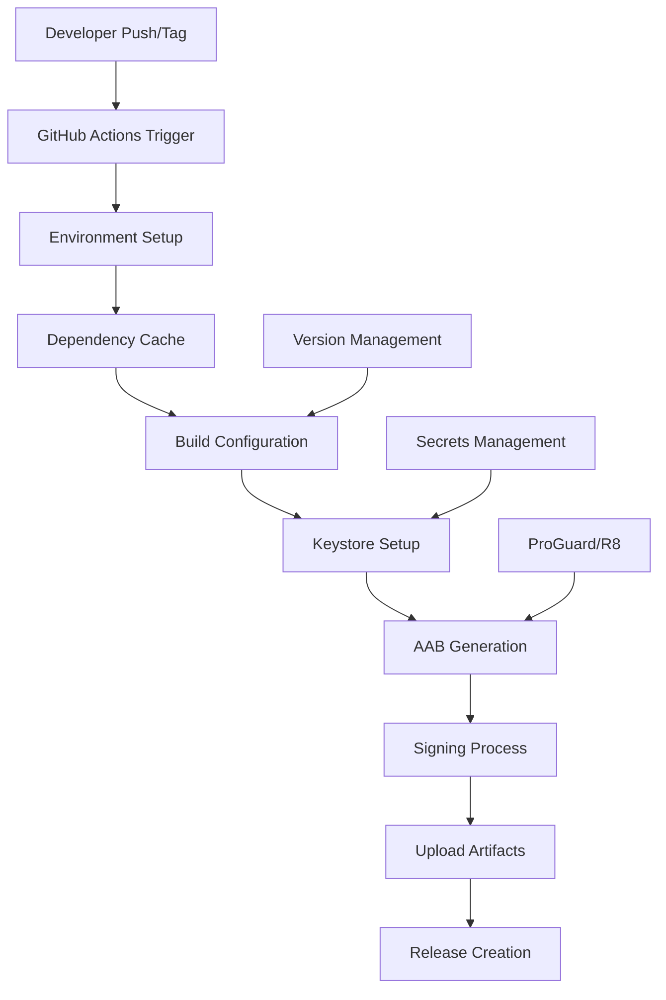
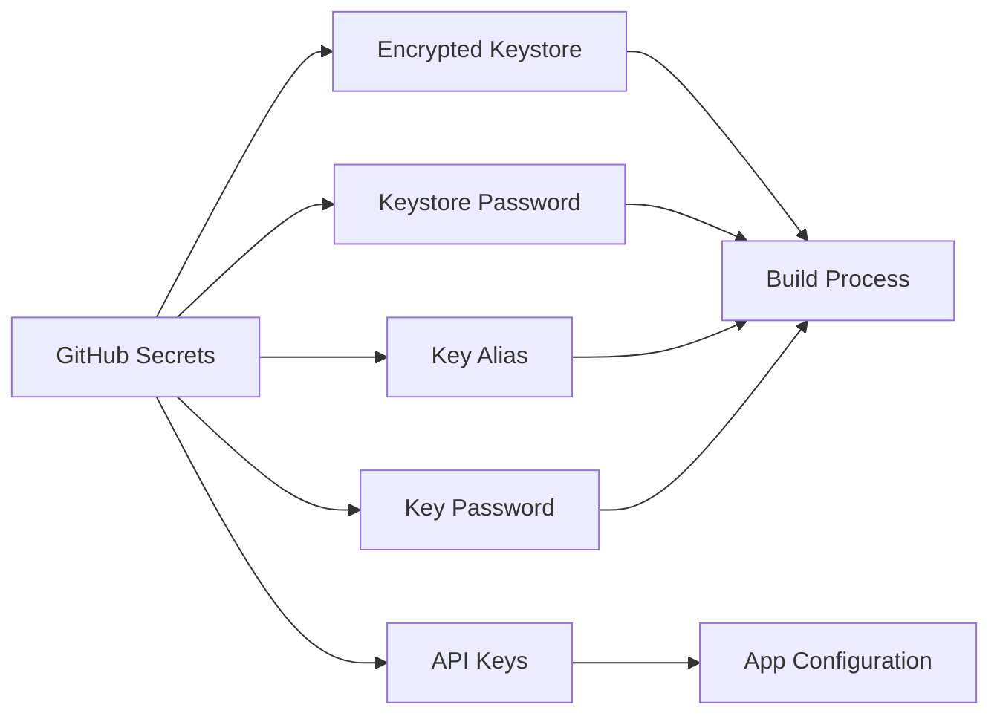

# Design Document

## Overview

This design document outlines the technical implementation for preparing the Crypto Tracker App for Google Play Store deployment. The solution focuses on automated AAB (Android App Bundle) generation, secure APK signing, and compliance with Google Play Store requirements through GitHub Actions CI/CD pipeline.

## Architecture

### Build Pipeline Architecture



### Security Architecture



## Components and Interfaces

### 1. GitHub Actions Workflow

**File**: `.github/workflows/release.yml`

**Purpose**: Automate the build, signing, and release process for Google Play Store deployment.

**Key Components**:
- Trigger configuration (tags, manual dispatch)
- Environment setup (JDK, Android SDK)
- Dependency caching
- Build execution
- Artifact management

### 2. Gradle Build Configuration

**File**: `app/build.gradle.kts` (modifications)

**Purpose**: Configure release build settings, signing, and optimization.

**Key Components**:
- Signing configuration
- Build types optimization
- Version management
- ProGuard/R8 configuration

### 3. Keystore Management

**Purpose**: Secure handling of app signing credentials.

**Components**:
- Encrypted keystore file storage
- Environment variable configuration
- Secure credential injection

### 4. Version Management System

**Purpose**: Automatic version code and version name management.

**Components**:
- Git tag-based versioning
- Automatic version code increment
- Semantic versioning support

## Data Models

### Build Configuration Model

```kotlin
data class BuildConfig(
    val versionCode: Int,
    val versionName: String,
    val applicationId: String,
    val buildType: String,
    val signingConfig: SigningConfig
)
```

### Signing Configuration Model

```kotlin
data class SigningConfig(
    val storeFile: File,
    val storePassword: String,
    val keyAlias: String,
    val keyPassword: String
)
```

### Release Artifact Model

```kotlin
data class ReleaseArtifact(
    val aabFile: File,
    val mappingFile: File,
    val versionCode: Int,
    val versionName: String,
    val releaseNotes: String
)
```

## Error Handling

### Build Failure Scenarios

1. **Missing Keystore**
   - Error: Keystore file not found or invalid
   - Handling: Fail build with clear error message
   - Recovery: Provide keystore setup instructions

2. **Invalid Credentials**
   - Error: Wrong keystore password or key alias
   - Handling: Fail build without exposing credentials
   - Recovery: Verify GitHub Secrets configuration

3. **Version Conflicts**
   - Error: Duplicate version code
   - Handling: Auto-increment or fail with suggestion
   - Recovery: Manual version adjustment

4. **Build Optimization Failures**
   - Error: ProGuard/R8 optimization issues
   - Handling: Provide detailed error logs
   - Recovery: ProGuard rules adjustment

### Security Error Handling

1. **Credential Exposure**
   - Prevention: Use GitHub Secrets exclusively
   - Detection: Scan for hardcoded credentials
   - Response: Immediate build failure

2. **Keystore Corruption**
   - Detection: Keystore validation before use
   - Response: Fail build with recovery instructions
   - Recovery: Keystore regeneration process

## Testing Strategy

### 1. Build Testing

**Unit Tests**:
- Gradle build script validation
- Version management logic
- Configuration parsing

**Integration Tests**:
- End-to-end build pipeline
- Signing process validation
- Artifact generation verification

### 2. Security Testing

**Credential Security**:
- Secret injection testing
- Keystore access validation
- Environment isolation verification

**Build Artifact Security**:
- Signed APK/AAB validation
- ProGuard mapping verification
- Debug information removal

### 3. Deployment Testing

**Google Play Compatibility**:
- AAB format validation
- API level compliance
- Permission declaration verification

**Performance Testing**:
- Build time optimization
- Cache effectiveness
- Resource usage monitoring

## Implementation Details

### GitHub Actions Workflow Structure

```yaml
name: Release Build
on:
  push:
    tags: ['v*']
  workflow_dispatch:

jobs:
  build:
    runs-on: ubuntu-latest
    steps:
      - name: Checkout
      - name: Setup JDK
      - name: Setup Android SDK
      - name: Cache Dependencies
      - name: Decode Keystore
      - name: Build AAB
      - name: Upload Artifacts
      - name: Create Release
```

### Gradle Signing Configuration

```kotlin
android {
    signingConfigs {
        create("release") {
            storeFile = file(System.getenv("KEYSTORE_FILE") ?: "keystore.jks")
            storePassword = System.getenv("KEYSTORE_PASSWORD")
            keyAlias = System.getenv("KEY_ALIAS")
            keyPassword = System.getenv("KEY_PASSWORD")
        }
    }
    
    buildTypes {
        release {
            signingConfig = signingConfigs.getByName("release")
            isMinifyEnabled = true
            isShrinkResources = true
            proguardFiles(
                getDefaultProguardFile("proguard-android-optimize.txt"),
                "proguard-rules.pro"
            )
        }
    }
}
```

### Version Management Strategy

1. **Automatic Version Code**: Based on Git commit count or timestamp
2. **Semantic Versioning**: Extract from Git tags (v1.2.3)
3. **Build Number**: Append build number for internal tracking

### ProGuard/R8 Optimization

**Optimization Levels**:
- Code shrinking: Remove unused code
- Resource shrinking: Remove unused resources
- Obfuscation: Rename classes and methods
- Optimization: Optimize bytecode

**Mapping Files**:
- Generate mapping files for crash reporting
- Store mapping files as build artifacts
- Version mapping files with releases

### Security Best Practices

1. **Keystore Security**:
   - Store keystore as base64-encoded GitHub Secret
   - Use strong passwords (minimum 12 characters)
   - Rotate credentials periodically

2. **API Key Management**:
   - Inject API keys during build time
   - Use different keys for debug/release
   - Implement key rotation strategy

3. **Build Environment**:
   - Use clean build environment
   - Validate all inputs
   - Minimize credential exposure time

### Google Play Store Compliance

1. **Target API Level**: Android 14 (API 34)
2. **Permissions**: Declare all required permissions
3. **App Bundle**: Use AAB format for optimal delivery
4. **64-bit Support**: Include ARM64 and x86_64 architectures
5. **Security**: Implement network security config

### Artifact Management

1. **AAB File**: Primary upload artifact for Google Play
2. **Mapping Files**: For crash reporting and debugging
3. **Release Notes**: Automated or manual release descriptions
4. **Checksums**: Verify artifact integrity

### Monitoring and Logging

1. **Build Metrics**: Track build times and success rates
2. **Error Reporting**: Detailed error logs for failures
3. **Security Monitoring**: Track credential usage
4. **Performance Monitoring**: Build optimization metrics